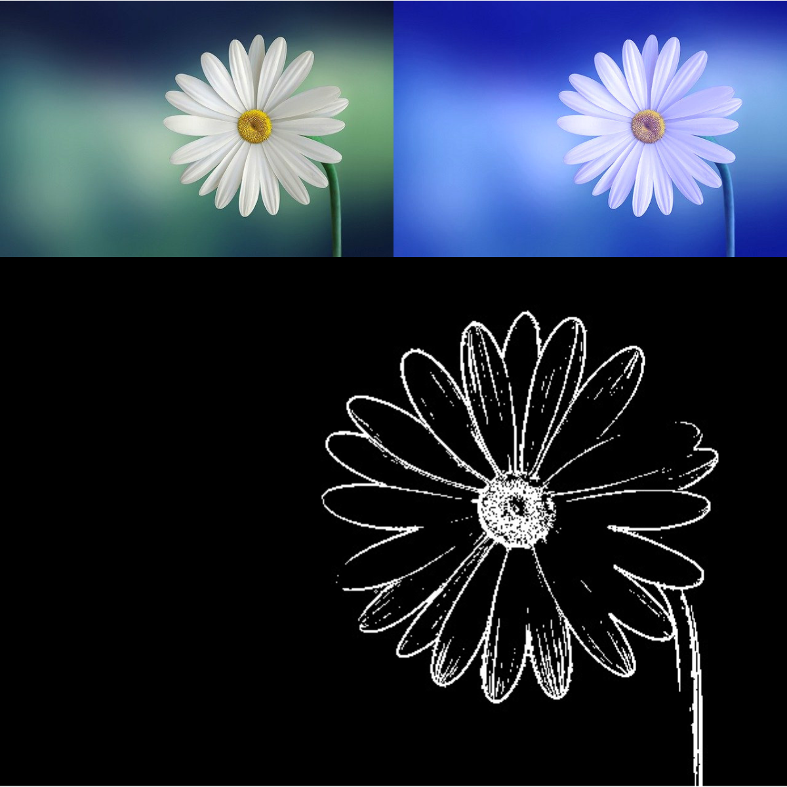

# Image processing with C++

Hi, Created this repo while learning about image creation and manipulation in C++.
Also Implemented Sobel Edge Filter.

## Learnings

- Image Type Research
- Compression
- Basic Image
- Applying Filters
- Using Sobel Filter for edge detection

## Output



## Image Research

- Lossless Compression: Compression that can be reversed with no data loss
- Lossy Compression: Compression that loses data when uncompressed. Many times its data that didn't matter
- Raw Images: Pixel RGBa or RGB values
- We mostly using External Libraries for Image Manipulation but today for understand purpose we will be applying algorithm on PPM images

### PPM - Portable Pixmap Format

- We will be using PPM P3, as it uses rgb in the picture format!!
- It will be easy to read and work with
- Note: In real world we will not be using PPM as it is a raw format with large size
- Format

  ```text
  For PPM:
  type
  width height
  max RGB value
  Body: All pixel data that describes the image[In parts of 3][Each individual pixals]
  ```

### Applying Filters to Images

- We will be taking a Image and then creating a new Image by applying filter to it.
- Many filters can be applied, we will see only simple copy and blue filter and also edge detection

## Installation

README for running C++ program

This is a guide on how to run a C++ program on your computer.

### Prerequisites

In order to run a C++ program, you need to have a C++ compiler installed on your computer. If you don't have one already, you can install one of the popular compilers such as GCC or Clang. Additionally, you will need a text editor to write your code. Some popular choices include Visual Studio Code, Sublime Text, and Atom.

### Compiling the program

Once you have written your C++ code, you need to compile it in order to create an executable file. To do this, open a terminal or command prompt and navigate to the directory where your source code file is located. Then, type the following command:

```bash
  g++ main.cpp src/ImageProcessor/ImageProcessor.cpp -o main.out
```

### Running the program

Once you have compiled your program, you can run it by typing the following command in the terminal or command prompt:

```bash
  ./main.out
```

This will execute your program and you should see the output in the output folder in images.

## Conclusion

That's it! You now know how to compile and run a C++ program on your computer. Happy coding!

## Special Thanks

- <https://www.youtube.com/watch?v=HGHbcRscFsg>
